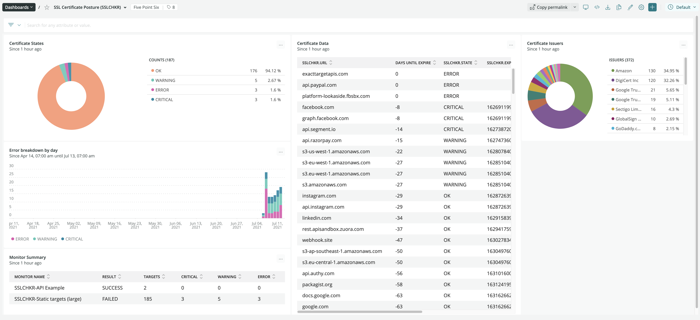

# Bulk SSL Checker

This application allows you to check SSL certificate expiry in bulk. The application is a nodejs script that can run within the New Relic Synthetics minion. The terraform package allows you to easily deploy the application to your account, it automates provisioning of of the synthetic, secure credentials, posture dashboards. You may also simply copy and paste the [script](./copy-paste-example.js) if you do not want to use terraform.

## Defining targets
The targets to test are provided by calling the function getTargets(). You can provide the payload of this function which may return static data or if you like you can request dynamic data to be used via an API call. Targets are expected to be in the following JSON format:

```json
[
    {
        "name":"BBC News"
        "domain":"news.bbc.co.uk"
    },
    {
        "domain":"foo.com",
        "hosts": [
            "111.222.333.444",
            "555.666.777.888",
        ]
    },
    {
        "domain":"bam.com",
        "timeout": 10000,
        "hosts": [
            "111.222.333.444",
            "555.666.777.888",
        ]
    },
    {
        "domain":"self-signed-cert.com",
        "allowUnauthorized": true
    },
    {...}
]
```

* `name`: Optional - Friendly Name of the site being tested
* `domain`: Required - The domain name to test
* `hosts`: Optional - An array of IP addresses to test, skipping DNS
* `timeout`: Optional - miiliseconds timeout (default 5000)
* `allowUnauthorized`: Optional - if `true` then cert will not be validated against CA (useful for self-signed)


## Getting started (Terraform)

1. Checkout the repo
2. Copy `runtf.sh.sample` to `runtf.sh` and add your API keys
3. `terraform init` to initialise
4. `./runtf.sh apply` to deploy to New Relic.

### Configuration

* API Keys - `./terraform/runtf.sh`
* Target Data Sources - `./terraform/main.tf`
* Thresholds and timeouts - `./terraform/modules/sslchecker/modules/sslminion/src/synthetic.js` (built)

The boilerplate example references [static_small.js](./terraform/targetdata/static_small.js) from `main.tf` which is a small java script funciton that defines the SSL (TLS) domains to test. There are some other exmaples here of how to specify these. You can event query an API to drive the configuration as demonstrated in [api-driven.js](./terraform/targetdata/api-driven.js).

### Dashboard

The application comes with a built in dashboard. Set up alerts as you require.



## Getting started (Copy and Paste)
Simply copy and paste the [`copy-paste-example.js`](./copy-paste-example.js) into a Scripted API synthetic monitor. You will need to provide an ingest API key (prefereably via a secure credential) and define your getTargets() function. Refer to the [example scripts](./terraform/targetdata/) for configuration ideas.